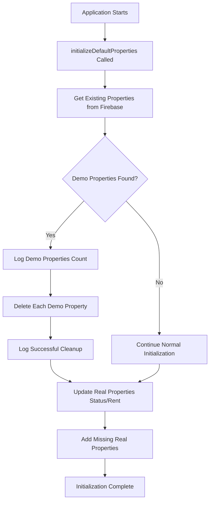

# Demo Property Cleanup Process - Developer Guide

## 🎯 Overview

The MSA Properties application includes an automatic demo property cleanup system to ensure that test/demo properties never appear on the live production website. This guide explains how the system works and how to maintain it.

## 🚨 Problem Statement

During development and testing, demo properties with hardcoded IDs ('2', '3', '4') were accidentally appearing on the live website. These included:

- **Modern City Centre Flat** (ID: '2') - £1800/month
- **Charming Garden Flat** (ID: '3') - £1200/month  
- **Luxury Penthouse Apartment** (ID: '4') - £3500/month

This created confusion for users who saw fake properties alongside real listings.

## 🛡️ Solution Architecture

### Automatic Detection & Cleanup

The cleanup system is built into the `initializeDefaultProperties` function in `/src/lib/properties.ts` and runs automatically when:

1. The application starts up
2. Firebase is initialized
3. Properties are synchronized

### Key Components

#### 1. Demo Property Detection
```typescript
// Hardcoded demo property IDs that should never exist in production
const demoPropertyIds = ['2', '3', '4'];
const demoProperties = existingProperties.filter(property => 
  demoPropertyIds.includes(property.id)
);
```

#### 2. Safe Removal Process
```typescript
if (demoProperties.length > 0) {
  console.log(`🗑️  Removing ${demoProperties.length} demo properties from Firebase...`);
  for (const demoProperty of demoProperties) {
    console.log(`❌ Removing demo property: ${demoProperty.title}`);
    await deleteProperty(demoProperty.id);
  }
  console.log('✅ Removed demo properties from Firebase');
}
```

#### 3. Production Safety Measures

- **Whitelist Approach**: Only properties with IDs '2', '3', '4' are removed
- **Logging**: All cleanup actions are logged for debugging
- **Error Handling**: Cleanup failures don't crash the application
- **Idempotent**: Safe to run multiple times

## 📋 Implementation Details

### File Locations

- **Main Logic**: `/src/lib/properties.ts` - `initializeDefaultProperties()` function
- **Static Data**: `/src/data/properties.ts` - Contains only real properties
- **Tests**: `/src/lib/__tests__/properties-demo-cleanup.test.ts`
- **Documentation**: `/SOLD_PROPERTY_FUNCTIONALITY.md` (includes cleanup info)

### Execution Flow



### Error Handling

The cleanup system includes robust error handling:

```typescript
try {
  await deleteProperty(demoProperty.id);
} catch (error) {
  // Error is logged but doesn't prevent other operations
  console.error('Failed to delete demo property:', error);
}
```

## 🔧 Maintenance Guide

### Adding New Demo Properties to Cleanup

If you need to add new demo property IDs to the cleanup list:

1. **Update the demo property IDs array**:
   ```typescript
   // In /src/lib/properties.ts
   const demoPropertyIds = ['2', '3', '4', 'new-demo-id'];
   ```

2. **Add corresponding tests**:
   ```typescript
   // In /src/lib/__tests__/properties-demo-cleanup.test.ts
   const demoPropertyIds = ['2', '3', '4', 'new-demo-id'];
   ```

3. **Update documentation** in relevant markdown files

### Testing the Cleanup System

#### Unit Tests
```bash
npm test -- --testPathPattern="properties-demo-cleanup.test.ts"
```

#### Manual Testing
1. Add a demo property with ID '2', '3', or '4' to Firebase
2. Restart the application or trigger `initializeDefaultProperties()`
3. Verify the demo property is automatically removed
4. Check console logs for cleanup messages

### Monitoring & Debugging

#### Console Output
Look for these log messages during initialization:

```
🗑️  Removing 3 demo properties from Firebase...
❌ Removing demo property: Modern City Centre Flat
❌ Removing demo property: Charming Garden Flat  
❌ Removing demo property: Luxury Penthouse Apartment
✅ Removed demo properties from Firebase
```

#### Firebase Console
- Check Firestore console to verify demo properties are removed
- Monitor for any unexpected property deletions

## 🚀 Production Deployment

### Pre-Deployment Checklist

- [ ] Verify only real properties exist in `/src/data/properties.ts`
- [ ] Run cleanup tests: `npm test -- --testPathPattern="demo-cleanup"`
- [ ] Check Firebase Firestore for any demo properties
- [ ] Verify demo property IDs are correct in cleanup logic

### Post-Deployment Verification

1. **Check Live Site**: Verify no demo properties appear on msaproperties.co.uk
2. **Monitor Logs**: Check for cleanup messages in deployment logs
3. **Firebase Verification**: Ensure Firestore contains only real properties

## 🔍 Troubleshooting

### Common Issues

#### Demo Properties Still Appearing
**Symptoms**: Demo properties visible on live site
**Solutions**:
1. Check if `initializeDefaultProperties()` is being called
2. Verify demo property IDs in cleanup logic
3. Check Firebase permissions for property deletion
4. Review console logs for cleanup errors

#### Cleanup Not Running
**Symptoms**: No cleanup log messages
**Solutions**:
1. Verify Firebase connection is established
2. Check if `getAllProperties()` returns existing properties
3. Ensure cleanup logic isn't being skipped due to conditions

#### Real Properties Being Deleted
**Symptoms**: Legitimate properties disappearing
**Solutions**:
1. **IMMEDIATE**: Check demo property IDs array for typos
2. Review recent changes to cleanup logic
3. Check Firebase audit logs for unexpected deletions
4. Restore from backup if necessary

### Debug Mode

Enable detailed logging by setting:
```typescript
// Temporary debug logging
console.log('🔍 Debug - Existing properties:', existingProperties.map(p => ({ id: p.id, title: p.title })));
console.log('🔍 Debug - Demo property IDs:', demoPropertyIds);
```

## 📊 Analytics & Monitoring

The cleanup system includes analytics tracking:

```typescript
// Track cleanup events
trackAdminAction('Demo Property Cleanup', 'Properties Removed', {
  removedCount: demoProperties.length,
  removedIds: demoProperties.map(p => p.id),
});
```

## 🔮 Future Enhancements

### Planned Improvements

1. **Environment-Based Cleanup**: Different demo IDs for different environments
2. **Automated Testing**: CI/CD pipeline tests for cleanup functionality
3. **Admin Dashboard**: UI for monitoring and manually triggering cleanup
4. **Backup System**: Automatic backup before demo property deletion

### Configuration Options

Consider adding environment variables:
```typescript
const DEMO_PROPERTY_IDS = process.env.DEMO_PROPERTY_IDS?.split(',') || ['2', '3', '4'];
const ENABLE_DEMO_CLEANUP = process.env.ENABLE_DEMO_CLEANUP !== 'false';
```

## 📚 Related Documentation

- [`SOLD_PROPERTY_FUNCTIONALITY.md`](./SOLD_PROPERTY_FUNCTIONALITY.md) - Includes demo cleanup section
- [`FIREBASE_SETUP.md`](./FIREBASE_SETUP.md) - Firebase configuration details
- [`TESTING.md`](./TESTING.md) - Testing procedures and guidelines

## 🤝 Contributing

When modifying the cleanup system:

1. **Add Tests**: Always include unit tests for new cleanup logic
2. **Update Documentation**: Keep this guide and related docs current
3. **Test Thoroughly**: Verify cleanup works in development and staging
4. **Monitor Production**: Watch for any issues after deployment

## ⚠️ Critical Safety Notes

- **Never add real property IDs** to the demo cleanup list
- **Always test cleanup logic** in development first
- **Monitor Firebase carefully** after deployment
- **Keep backups** of property data before major changes
- **Use staging environment** to test cleanup modifications

---

*Last Updated: January 2025*  
*Version: 1.0*  
*Maintainer: MSA Properties Development Team*
